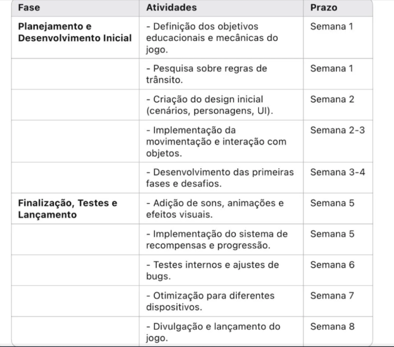

**Documentação do Sistema**

SUMÁRIO

[Dados do Cliente	2](#_heading=h.gjdgxs)

[Equipe de Desenvolvimento	3](#_heading=h.30j0zll)

[1. Introdução	4](#_heading=h.1fob9te)

[2. Objetivo	5](#_heading=h.3znysh7)

[3. Escopo	6](#_heading=h.2et92p0)

[4. Backlogs do Produto	7](#_heading=h.tyjcwt)

[5. Cronograma	8](#_heading=h.3dy6vkm)

[6. Materiais e Méhttps://www.linkedin.com/in/auto-escola-357769358todos	9](#_heading=h.1t3h5sf)

[7. Resultados	10](#_heading=h.4d34og8)

[8. Conclusão	11](#_heading=h.2s8eyo1)

[9. Homologação do MVP junto ao cliente	12](#_heading=h.17dp8vu)

[10. Divulgação	13](#_heading=h.3rdcrjn)

[11. Carta de Apresentação	15](#_heading=h.26in1rg)

[12. Carta de Autorização	16](#_heading=h.lnxbz9)

[13. Relato individual do processo	18](#_heading=h.35nkun2)

|<h1>**Dados do Cliente**</h1>|
| - |
Título do Projeto:  Auto escola virtual
Cliente: Jose Benicio Da Costa Sobrinho 

CNPJ/CPF: 77766571820

Contato: Jose

Email do contato: zebenicio@gmail.com

|<h1>**Equipe de Desenvolvimento** </h1>|
| - |

|**Nome completo**|**Curso**|**Disciplina**|
| :-: | :-: | :-: |
|Ismael Lourenço Benicio |Ciencias da Computação|Progamação de Software básico em C|
|Pedro Henrique Menegatti Sandoval|Ciencia da Computação|Progamação de Software básico em C|
|Marcelo Pereira Alvarez Pedro|Ciencia da Computação|Progamação de Software básico em C|
|Yãry Castilho De Andrade|Ciencia da Computação|Progamação de Software básico em C|
|Laís Roberta Estevam Dos Santos|Engenharia da Computação|Progamação de Software básico em C|

|**Professor Orientador**|
| :-: |
|Kesede Rodrigues Julio|

|<h1>1. **Introdução**</h1>|
| Atualmente, muitos condutores iniciantes enfrentam dificuldades para compreender e aplicar as regras de trânsito de forma segura e eficiente. A falta de conhecimento prático e teórico pode resultar em infrações e aumentar o risco de acidentes.

Para solucionar esse problema, estamos desenvolvendo o Auto Escola Virtual, um jogo educativo que simula situações reais do trânsito, permitindo que os usuários aprendam de forma interativa e gamificada. O jogo abordará sinalização, legislação e boas práticas de direção por meio de desafios e testes. |

|<h1>2. **Objetivo**</h1>|
| O objetivo do Auto Escola Virtual é ensinar crianças de forma lúdica e interativa sobre as regras de trânsito, promovendo a conscientização desde cedo. |

|<h1>3. **Escopo**</h1>|
| A implementação abrangerá os seguintes requisitos principais:
	1.	Cenários e Simulações Interativas
	2.	Desafios e Missões Educativas

O que não será implementado:
	•	O jogo não incluirá simulação de direção (com volante), pois o foco é a conscientização infantil sobre segurança no trânsito.

|<h1>4. **Backlogs do Produto**</h1>|
| 1 -  O jogo contará com diferentes cenários urbanos e rodoviários, onde as crianças poderão aprender sobre sinalização, travessia segura, respeito ao semáforo e comportamento adequado no trânsito como pedestres, ciclistas e passageiros.
2 - Serão implementadas missões e desafios práticos, como identificar placas de trânsito, atravessar ruas corretamente e respeitar as regras de ciclovias. As crianças receberão recompensas e feedbacks positivos ao completarem as atividades corretamente. |

|<h1>5. **Cronograma**</h1>|

!

|<h1>6. **Materiais e Métodos**</h1>|
| - |

1. **Modelagem do sistema**:  
2. **Tecnologias utilizadas**: O jogo está sendo desenvolvido na linguagem C utilizando a biblioteca Allegro, uma das principais bibliotecas gráficas para desenvolvimento de jogos 2D. O Allegro oferece suporte a gráficos, áudio, teclado e outros dispositivos de entrada, sendo ideal para a criação de jogos educativos como o Auto Escola Virtual.

3. **Arquitetura do sistema**:  A arquitetura é baseada em módulos, com separação entre a lógica do jogo, controle de entrada, gerenciamento de gráficos e sistema de pontuação. Essa abordagem modular facilita a organização do código, a identificação de falhas e a escalabilidade do projeto, permitindo a adição de novos conteúdos e fases com facilidade.

|<h1>7. **Resultados**</h1>|
| - |

1. **Protótipo**:  Foi desenvolvido um protótipo funcional do Auto Escola Virtual, apresentando menus de navegação, personagens, cenários urbanos e desafios educativos. O protótipo permite ao usuário interagir com o ambiente de forma simples, reforçando conceitos de educação no trânsito por meio de escolhas e feedbacks visuais.
1. **Códigos das principais funcionalidades**: 
As principais funcionalidades programadas incluem:

- Sistema de pontuação com feedback imediato;
- Reconhecimento de acertos e erros nas missões (por exemplo, atravessar na faixa, respeitar o semáforo);
- Progressão de fases com aumento gradual da dificuldade;
- Interface inicial com instruções e escolha de cenário.

|<h1>8. **Conclusão**</h1>|
| - |

1. **Impacto do sistema:** O Auto Escola Virtual representa uma iniciativa inovadora de educação no trânsito voltada ao público infantil, utilizando jogos como ferramenta de aprendizagem. A gamificação aliada ao conteúdo educativo promove maior engajamento e facilita a assimilação das regras de trânsito desde a infância, contribuindo com a formação de futuros cidadãos mais conscientes.

2. **Melhorias Futuras**: 
- Inclusão de novos cenários, como ambientes escolares e zonas rurais;
- Adição de narração e trilha sonora para melhor acessibilidade;
- Migração para plataforma web ou mobile, ampliando o acesso ao público;
- Integração com banco de dados para salvar progresso e estatísticas do jogador.

|<h1>9. **Homologação do MVP junto ao cliente**</h1>|
| - |

Após as entregas parciais, realizadas de acordo com os requisitos do sistema  e cronograma, o MVP foi apresentado em uma reunião, realizada entre o time de desenvolvedores e o cliente.

|||
| :-: | :-: |
|Da esquerda para direita: ||
|||
|Participantes da homologação assistindo a apresentação|Participantes da homologação|

Segue abaixo a lista de presentes na homologação do MVP.

|**Lista de presentes na Homologação**|
| :-: |
||

Ao final da apresentação, o sistema  foi homologado pelo cliente.

|<h1>10. **Divulgação**</h1>|
| - |

1. **Linkedin do Projeto**

  

   Insira o linnk deste perfil com o seu perfil pessoal do Linkedin.

|||
|https://www.linkedin.com/in/virtua-school-059b28359/ | https://br.linkedin.com/in/ismaellouren%C3%A7obenicio |

1. **Seminário de Projetos de Software**

   **Vídeo da apresentação:** 
|||
| :-: | :-: |
|Da esquerda para direita: ||
|||
|Participantes do evento assistindo a apresentação|Participantes do evento assistindo a apresentação|

Segue abaixo a lista de presentes na apresentação.

|**Lista de presentes na Apresentação**|
| :-: |
||

1. **FENETEC: Feira de Negócios em Tecnologia**

   **Apresentação do projeto:** 

|||
| :-: | :-: |
|Da esquerda para direita: ||
|||
|Participantes do evento assistindo a apresentação|Estandes da FENETEC|

Segue abaixo a lista de presentes na FENETEC.

|**Lista de presentes na Apresentação**|
| :-: |
||

|<h1>11. **Carta de Apresentação**</h1>|
| - |
Vimos por desta apresentar o grupo de acadêmicos do Centro Universitário Unimetrocamp, localizada à Rua Sales de Oliveira, 1661 - Campinas - SP, a fim de convidá-lo a participar de uma atividade extensionista associada ao componente curricular , sob responsabilidade do orientador Prof. Kesede Rodrigues Julio (profkesede64@gmail.com).

Em consonância ao Plano Nacional de Educação vigente, o Centro Universitário Unimetrocamp promove o Desenvolvimento de Software que, norteados pela metodologia de Gerenciamento Ágil Scrum, tem por princípios fundantes o diagnóstico dos problemas/demandas/necessidades, a participação ativa dos interessados/públicos participantes, a construção dialógica, coletiva e experiencial de conhecimentos, o planejamento de ações, o desenvolvimento e avaliação das ações, a sistematização dos conhecimentos, a avaliação das ações desenvolvidas.

Nesse contexto, a disciplina acima mencionada tem como principal escopo os temas relacionados à Programação Orientada à Objeto / Padrões de Projetos de Software, no que diz respeito ao desenvolvimento de um software utilizando Programação Orientada à Objeto.

Sendo assim, pedimos o apoio de  para a realização das seguintes atividades: levantamento de requisitos, validação das entregas parciais, revalidação dos requisitos, homologação do MVP, ou qualquer outra intervenção que auxilie no desenvolvimento das competências de nossos acadêmicos e ao mesmo tempo possa contribuir para a comunidade em que estamos inseridos.

Aproveitamos a oportunidade para solicitarmos, em caso de aceite, que a parceria seja formalizada, mediante assinatura da Carta de Autorização, as atividades e informações que o(s) aluno(s) poderá(ão) ter acesso.

Em tempo, registramos ainda, o convite para a participação de todos os interessados no fórum semestral de acompanhamento e avaliação das atividades realizadas, que está previsto para o final deste semestre, e será comunicado previamente em convite específico.

Desde já nos colocamos à sua disposição para quaisquer esclarecimentos.

Atenciosamente,

Campinas, \_\_\_\_ de \_\_\_\_\_\_\_\_\_ de 202\_\_\_.

\_\_\_\_\_\_\_\_\_\_\_\_\_\_\_\_\_\_\_\_\_\_\_\_\_\_\_\_\_\_\_\_\_\_\_\_

**Assinatura Direção Acadêmica da IES**

` `

\_\_\_\_\_\_\_\_\_\_\_\_\_\_\_\_\_\_\_\_\_\_\_\_\_\_\_\_\_\_\_\_\_\_\_\_

**Assinatura Docente**

|<h1>12. **Carta de Autorização**</h1>|
| - |
Eu, (preencher com nome do responsável), (preencher com cargo ocupado), da (nome da empresa, organização, associação, escola, secretaria, etc., situada no endereço – inserir o endereço), autorizo a realização das seguintes atividades acadêmicas do componente extensionista <código e nome da disciplina>, do Centro Universitário Unimetrocamp, sob orientação do Prof. Kesede Rodrigues Julio.

|**Atividades:**|
| - |
|** |
|** |
|** |
|** |

Conforme combinado em contato prévio, as atividades acima descritas são autorizadas para os seguintes alunos:

|**Nome dos/das alunos/as**|**Curso**|**Matrícula**|
| :-: | :-: | :-: |
| | | |
| | | |
| | | |
| | | |
||||

Declaro que fui informado por meio da **Carta de Apresentação** sobre as características e objetivos das atividades que serão realizadas na organização/instituição/empresa a qual represento e afirmo estar ciente de tratar-se de uma atividade realizada com intuito **exclusivo de ensino de alunos de graduação**, sem a finalidade de exercício profissional.

Desta forma, autorizo, em caráter de confidencialidade:

- ` `o acesso a informações e dados que forem necessários à execução da atividade;
- ` `o registro de imagem por meio de fotografias;
- ` `outro: (especificar)

Campinas, \_\_\_ de \_\_\_\_\_\_\_\_\_\_\_de 202\_.

\_\_\_\_\_\_\_\_\_\_\_\_\_\_\_\_\_\_\_\_\_\_\_\_\_\_\_\_\_\_\_\_\_\_\_\_\_\_\_\_\_\_\_\_\_\_\_\_\_\_\_\_\_\_\_\_\_\_\_\_\_\_\_\_\_\_\_

(Assinatura, nome completo do responsável, email de contato e com carimbo da empresa)

|<h1>13. **Relato individual do processo**</h1>|
| - |

|<nome do aluno>|
| :- |
|<um breve relato pessoal sobre o trabalho extensionista desenvolvido>|

|<nome do aluno>|
| :- |
|<um breve relato pessoal sobre o trabalho extensionista desenvolvido>|

|<nome do aluno>|
| :- |
|<um breve relato pessoal sobre o trabalho extensionista desenvolvido>|

|<nome do aluno>|
| :- |
|<um breve relato pessoal sobre o trabalho extensionista desenvolvido>|

|<nome do aluno>|
| :- |
|<um breve relato pessoal sobre o trabalho extensionista desenvolvido>|

